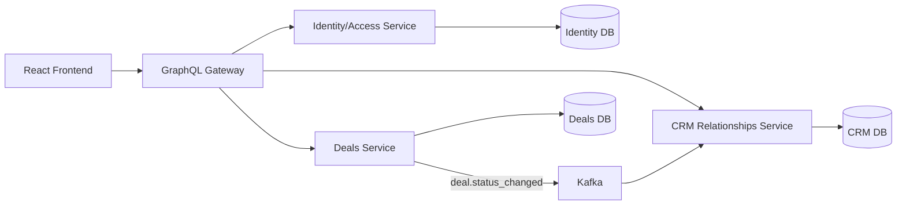

# Event-Driven CRM System Design

## 1. Overview

This document describes the high-level design for a small event-driven CRM system.

The system supports:

- parent and child companies
- contacts within companies
- deals attached to companies and optionally to a primary contact
- activity history and follow-up tasks
- role-based access control for internal users
- one asynchronous workflow implemented with Kafka

The design intentionally favors a small, coherent subset of CRM behavior over a broad feature set.

Backend services are implemented as standard Django applications. `Nx` is treated only as the repository/workspace orchestration layer required by the specification, not as a replacement for Django service structure.

## 2. Scope

### In Scope

- company hierarchy with parent and child companies
- internal users with roles
- contacts for external customer/prospect companies
- deals with lifecycle stages
- activities as historical interaction records
- tasks as follow-up work items
- GraphQL federation across multiple backend services
- Kafka-based asynchronous processing

### Out of Scope

- email/calendar sync
- file attachments
- advanced reporting and dashboards
- multi-company membership for a single user
- multiple participants on one activity
- separate lead entity

### Implementation Profile

To keep the scope realistic, the implementation should prioritize:

- correct service boundaries
- a working federated GraphQL flow
- one well-executed Kafka workflow
- server-side authorization
- basic observability such as structured logs and health checks
- a small but coherent UI surface

The design also includes production hardening guidance so the system has a credible path beyond the initial implementation, but not every operational concern needs to be fully implemented in the first release.

## 3. Architecture Principles

This design follows a small set of production-oriented principles:

- single ownership of each domain entity
- database per service
- no cross-service database joins
- synchronous reads through GraphQL federation
- asynchronous side effects through Kafka
- server-side authorization at every backend boundary
- idempotent event consumers
- observable systems with logs, metrics, and traces
- backward-compatible API and event evolution

## 4. Core Domain Model

### Company

Represents a customer or prospect company. Companies are organized in a parent-child hierarchy.

Suggested fields:

- `id`
- `name`
- `parent_company_id` (nullable)
- `created_at`
- `updated_at`

### Contact

Represents an external person who works at a company and can be reached for sales or relationship activity.

Suggested fields:

- `id`
- `company_id`
- `name`
- `email`
- `job_title`
- `created_at`
- `updated_at`

### Deal

Represents a sales opportunity that moves through stages over time.

Suggested fields:

- `id`
- `company_id`
- `primary_contact_id` (nullable)
- `status`
- `created_at`
- `updated_at`

### Activity

Represents something that already happened, such as a call, meeting, or email.

Suggested fields:

- `id`
- `company_id`
- `contact_id` (nullable)
- `deal_id` (nullable)
- `user_id`
- `type`
- `details`
- `occurred_at`
- `created_at`

### Task

Represents follow-up work that should happen in the future.

Suggested fields:

- `id`
- `title`
- `company_id`
- `contact_id` (nullable)
- `deal_id` (nullable)
- `user_id`
- `status`
- `due_date`
- `priority`
- `created_at`
- `updated_at`

### User

Represents an internal CRM user. External contacts are not users of the CRM.

Suggested fields:

- `id`
- `company_id`
- `name`
- `role`
- `email`
- `created_at`
- `updated_at`

## 5. Data Modeling Standards

To keep the system production-ready and maintainable, all services should follow common data conventions.

### Record Conventions

- use stable UUID-style identifiers rather than integer IDs
- include `created_at` and `updated_at` on mutable records
- use soft deletion only where recovery is required; otherwise prefer hard delete plus audit logs
- store timestamps in UTC
- represent statuses and activity types as enums in application code and constrained values in storage

### Constraints

- `Contact.email` should be unique within a company, not necessarily globally
- `Deal.primary_contact_id`, when present, must reference a contact from the same company
- `Task` must reference exactly one owning company and may optionally reference a contact and/or deal under that company
- `Company.parent_company_id` must not create cycles

### Auditability

- important state transitions, especially deal status changes, should be audit logged
- asynchronous task creation should preserve the originating event ID for traceability

## 6. Architectural Approach

The system is split into three backend services plus a GraphQL gateway:

1. `Identity/Access Service`
2. `CRM Relationships Service`
3. `Deals Service`
4. `GraphQL Gateway`

Each backend service owns its own database. Services reference records from other services by ID rather than duplicating full data. The frontend communicates only with the GraphQL gateway.

Kafka is used for asynchronous workflows between services.

### Nx Usage

`Nx` should be used minimally and pragmatically:

- as the monorepo/workspace layer
- for task orchestration and developer commands
- for organizing frontend, gateway, and backend service projects in one repository

It should not be used to reshape the Django services into a non-idiomatic structure. Each backend service should still be a normal Django project with standard Python tooling, migrations, and application layout.

## 7. Architecture Diagram



## 8. Runtime Request Flow

### Synchronous Read/Write Path

1. The frontend sends GraphQL queries and mutations only to the gateway.
2. The gateway authenticates the request and forwards user context downstream.
3. Each service resolves only the fields it owns.
4. The gateway composes the final response for the client.

### Authentication and Context Propagation

- the gateway should validate the incoming JWT or session token
- downstream service calls should include trusted user context headers
- backend services must not trust frontend-provided role or company information directly
- every service must authorize access to the records it owns

## 9. Service Responsibilities

### Identity/Access Service

Owns:

- `User`
- role definitions and access checks

Responsibilities:

- authenticate users
- resolve the current user and role
- enforce or support server-side authorization rules

Does not own:

- company hierarchy data
- contacts
- deals
- activities
- tasks

### CRM Relationships Service

Owns:

- `Company`
- `Contact`
- `Activity`
- `Task`

Responsibilities:

- maintain parent-child company hierarchy
- maintain external contact records
- store interaction history
- manage follow-up work items
- consume deal status events and create follow-up tasks asynchronously

Does not own:

- user identities
- deal lifecycle state

### Deals Service

Owns:

- `Deal`

Responsibilities:

- create and update deals
- manage deal status transitions
- publish deal lifecycle events to Kafka

Does not own:

- company details beyond `company_id`
- contact details beyond `primary_contact_id`
- tasks or activity history

## 10. Data Ownership and Federation

The design uses clear ownership boundaries:

- `Company` and `Contact` are owned by `CRM Relationships`
- `Deal` is owned by `Deals`
- `User` is owned by `Identity/Access`
- `Task` and `Activity` are owned by `CRM Relationships`

Other services store foreign-key-like references such as:

- `company_id`
- `primary_contact_id`
- `user_id`
- `deal_id`

The GraphQL gateway composes data across services so the frontend can query a complete object graph without direct service-to-service joins in the UI.

Example:

- `Deals` returns `company_id`
- gateway resolves `company` from `CRM Relationships`
- frontend receives a single unified GraphQL response

## 11. GraphQL Schema Standards

To keep the federated API understandable and production-ready:

- each service should expose only the types and mutations it owns
- shared entity references should be resolved through federation keys, not duplicated source-of-truth records
- mutations should be explicit and business-oriented, such as `updateDealStatus`
- pagination should use cursor-based connections for list-heavy screens
- error responses should distinguish authorization, validation, and transient system errors

Example API shape:

- `Identity/Access`: `me`, `usersByCompany`
- `CRM Relationships`: `company`, `companies`, `contact`, `activities`, `tasks`
- `Deals`: `deal`, `deals`, `createDeal`, `updateDealStatus`

The implementation should stay intentionally small: only expose the queries and mutations needed by the chosen UI screens and async workflow.

## 12. Asynchronous Workflow

### Workflow Chosen

When a user changes a deal status, the system asynchronously creates follow-up work in the CRM Relationships service.

### Flow

1. User updates a deal status in the frontend.
2. Frontend sends a GraphQL mutation to the gateway.
3. Gateway forwards the mutation to the `Deals Service`.
4. `Deals Service` updates the deal and publishes a `deal.status_changed` event to Kafka.
5. `CRM Relationships Service` consumes the event.
6. It creates one or more follow-up `Task` records based on the new status.
7. The frontend eventually sees the new tasks through a later query or refresh.

### Why This Is Asynchronous

- follow-up work can fan out into multiple actions
- the original request does not need to block on downstream task creation
- Kafka provides a clean place for retries, observability, and eventual consistency

### Example Event Payload

```json
{
  "event_id": "evt_123",
  "occurred_at": "2026-03-13T14:30:00Z",
  "deal_id": "deal_42",
  "company_id": "company_10",
  "old_status": "new",
  "new_status": "qualified"
}
```

### Reliability Considerations

Baseline implementation:

- include `event_id` for deduplication
- consumers should be idempotent
- failures should be retried with bounded attempts
- logging and metrics should be added around publish and consume paths

Production hardening path:

- use an outbox pattern or equivalent transactional-publish mechanism so DB state and event publication stay consistent
- route poison messages to a dead-letter topic after bounded retries
- version event payloads so consumers can evolve safely

## 13. Access Control Model

Access control is enforced server-side.

High-level assumptions:

- each internal `User` belongs to exactly one company
- each user has one role
- child-company data is isolated from sibling child companies
- parent-company users may have visibility across their child companies

Example role ideas:

- `admin`
- `manager`
- `sales_rep`

Example access behavior:

- a child-company sales rep sees only that child company's records
- a parent-company manager can view records across children
- unauthorized records are filtered or rejected by backend services

## 14. Operational Standards

This section describes the target production posture. For the initial implementation, implementing a minimal but credible subset is sufficient.

### Security

- all service-to-service traffic should run over authenticated internal network channels
- secrets must come from environment variables or a secrets manager, never source control
- inputs must be validated at API boundaries
- audit logs should be retained for sensitive actions such as status transitions and access failures

### Observability

- structured logs with request ID and event ID correlation
- metrics for request latency, error rate, Kafka lag, consumer retries, and task creation throughput
- distributed tracing across gateway and backend services
- health and readiness endpoints for every service

### Reliability and Recovery

- database backups and restore procedures must exist per service
- Kafka consumers must support restart without duplicate side effects
- deployments should be rolling or otherwise minimize downtime
- schema migrations must be backward compatible during rolling deploys

### Testing

- unit tests for status-transition rules and permission logic
- integration tests for GraphQL gateway composition
- event-flow tests for `deal.status_changed -> task created`
- contract tests for event payload compatibility

Recommended initial subset:

- unit tests for permission checks and deal status transitions
- one integration test covering gateway composition
- one end-to-end or integration test for the Kafka-driven task creation flow

## 15. Frontend Surface

The frontend is intentionally small. Main screens:

- `Company/Contact View`
  - view company details, child relationship, contacts, activity history, and tasks
- `Deal List and Deal Detail`
  - view deals by company and update deal status
- `Task List`
  - view pending work items by assignee, status, or due date

The frontend communicates only with the GraphQL gateway and should show loading, error, and eventual-consistency states.

## 16. Deployment View

For local development, the system runs in Docker Compose. For a production-style deployment, the same logical components should remain separate:

- React frontend
- GraphQL gateway
- Identity/Access service
- CRM Relationships service
- Deals service
- Kafka broker and required topics
- one database per backend service

Container images should be independently deployable so each service can scale or roll back without forcing a full-system redeploy.

## 17. Key Design Tradeoffs

### Three services instead of four

An earlier option was to split `Task` and `Activity` into a separate `Engagement` service. This design keeps them in the `CRM Relationships Service` to reduce implementation overhead while preserving clear ownership.

### No separate Lead entity

`Lead` is not modeled separately. A small CRM subset is preferred, so sales progression is represented through `Deal.status`.

### Single-user Activity ownership

An activity may involve multiple internal participants in real life, but the initial design uses a single `user_id` for simplicity.

### Simple user-role model

The design assumes one company and one role per user. This avoids introducing membership tables or cross-company role mapping too early.

## 18. Future Improvements

- add richer permission models and company memberships
- support multiple internal participants per activity
- add notifications/reminders for tasks
- add audit timestamps to more entities
- add reporting and dashboards
- support more complex workflow rules for task generation
